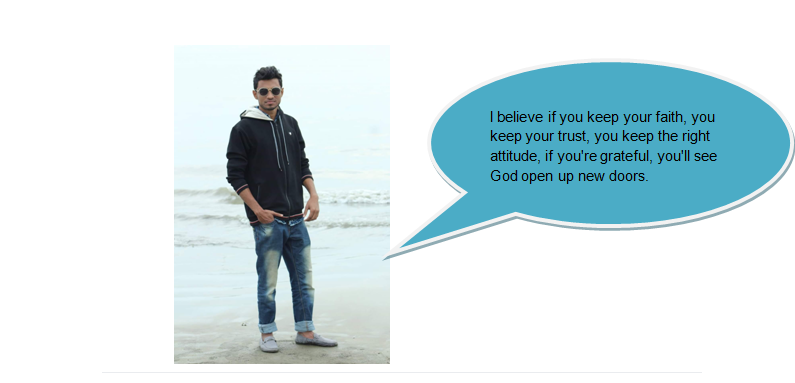

## smart-caption-generator

Smart Caption generator is an Android Application that would allow users to generate smart captions in view of their image. When uploading pictures to social media, users give different captions, which has adequacy with their image. For example,  a person is uploading a  picture of his with smile face, and he is captioning the photo "My smile is so beautiful". The caption of this photo of his is matching the picture with a suitable quote. We have drawn this caption as a smart caption. In terms of the image, users want to give a caption of quotes that is consistent with the image. Our application, using the TensorFlow model, will detect various tags from the image and output the similarities caption from the quotes collection. 
  So recapping the use of Machine Learning, we will generate different tags from the picture using the TensorFlow model. First, we will analyze the image face to detect Facial Emotion and also extend different kinds of features( such as attitude) which helps to recommend suitable captions. Then those generated tags send to a recommendation system that will return the best-suitable caption from quotes database .

## How our app help users:
How  our app help users? The process is first user select an image,after selection of an image our app first generate some tags, then tags go to recommendation system that will return the best-suitable caption. Here is complete architecture of our proposed application  .

  

 
				        Fig -1: Architecture of our application

Here is the sample of a quote from Quotes collection. The recommendation system will work on the collection of quote tags and input image tags (Tag generator Model output ).

  

  

                     Fig -2: A example of quote with tags

## Here are some demo images with a smart caption for a clear explanation.

 

  

                       Fig -3: Demo image_1 - Possibly generated tag “Attitude” 

 

   
 

                          Fig -4: Demo image_2 -  Possibly generated tag “Smile” 

 

                          Fig -5: Demo image_3 -Possibly generated tag “Attitude” 

 

 

                           Fig -6: Demo image_2 -Possibly generated tag “Inocent” 

## Google's Help :
  For this project, we will need a huge dataset to build a model that can generate tags or feature efficiently. And also need some suggestions for different techniques on how we can generate a more meaningful tag or feature for our recommendation system. So the only way to do that will be to ask for contributions in the form of dataset/code and some advice. It is almost impractical to build such a model without community help. I would like to get google's help in getting this project noticeable.
So here is the list of the ways you could use Google’s help
- Google can help us at the data collection step (Dataset - person's facial emotions and different kinds of looks like Attitude, Innocent, etc).
- Google can help us providing the suggestion of how we can generate more meaningful tags or features for recommendation systems.
- Google can help us with development support.
- Google can help us too providing comprehensive power for training our models.

	

# Project Timeline :
- December 25, 2019 - Completing the UX/UI of our application.
- January 2, 2020 - Collecting the dataset from kaggle(Emotion             detection).
- January 22 , 2020 - Collecting the dataset for detecting attitude, innocent or different kind of features from image and labeling those data with perfect   tag.	
- January 27, 2020 - Data processing
- February 07, 2020 - Model training for generating different tags or features.
- February 15, 2020 - Collecting quote dataset from the internet .
- February 25, 2020 - Finding out all tags corresponding to the quote dataset and labeling the dataset.
- March 07, 2020 - Training the recommendation model
- March 25, 2020 - Recaping the two models into one service.
- April 05, 2020 - Deploying the model into our android app using ML kit.
- April 15, 2020 - Updating the UI.	
- April 25, 2020 - Testing the app and fixing the issues if occurred.
- April 27, 2020 - Publishing app on Google Play.

## About me
Hi, I'm Bipul Mandol from Bangladesh. I love solving common problems that are out there. I also love hackathons and other coding events. I had participated in many developer events.I also love to learn new Development techniques for software development. Currently, I am a Bsc final year student and doing thesis on Bengali OCR and also working on two major projects “Talking glass”-the visually impaired helper android application and “Smart Tracking System”-android app for helping institutions for tracking their vehicles.

Github : https://github.com/mbbipul
Linkedin : https://www.linkedin.com/in/bipul-mandol-10b157140

Thursday, ‎October ‎24, ‎2019, at a workshop on DevOps in the IIT Institute Of Dhaka University, Bangladesh.

 

